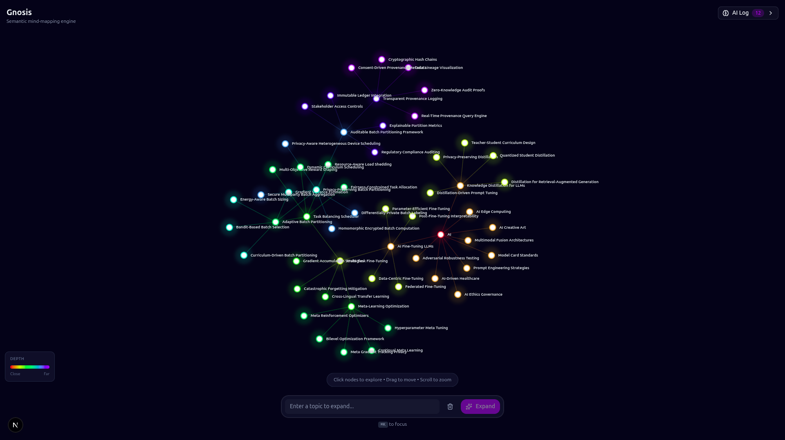
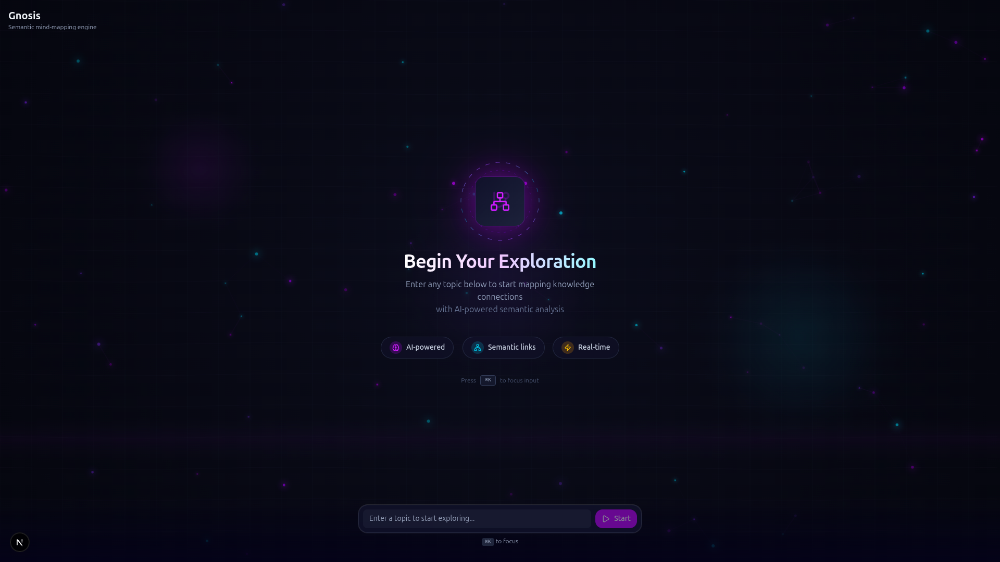

# Gnosis

A real-time semantic mind-mapping engine that helps you explore and connect ideas through AI-powered knowledge graphs.

## Overview

Gnosis transforms how you explore topics by creating dynamic, interconnected mind maps. Enter any concept and watch as the AI expands your knowledge graph with semantically related ideas, helping you discover connections you might never have found on your own.

### Key Features

- **AI-Powered Expansion** - Enter a topic and let the AI generate related concepts and connections
- **Semantic Search** - Find similar concepts using vector embeddings for intelligent matching
- **Real-Time Visualization** - Interactive force-directed graph that updates as you explore
- **Knowledge Persistence** - Your mind map saves automatically to local storage
- **Neural Logging** - See the AI's reasoning process as it expands your knowledge graph

## Screenshots


*Mind map with expanded knowledge graph*


*Initial empty state before exploration*

## Tech Stack

| Layer | Technology |
|-------|------------|
| Frontend | Next.js 16, React 19, TanStack Query v5 |
| Visualization | react-force-graph-2d |
| Styling | Tailwind CSS v4, shadcn/ui, Motion v12 |
| Backend | FastAPI (Python 3.12+) |
| LLM | LangChain + Cerebras |
| Embeddings | Voyage AI (voyage-3) |
| Vector DB | Qdrant (cloud-hosted) |
| Monorepo | Turborepo, pnpm |

## Project Structure

```
gnosis/
├── apps/
│   ├── api/              # FastAPI backend
│   └── web/              # Next.js frontend
├── packages/
│   ├── ui/               # Shared UI components
│   ├── eslint-config/    # ESLint configurations
│   └── typescript-config/# TypeScript configurations
└── docs/                 # Documentation
```

## Getting Started

### Prerequisites

- Node.js 22+
- pnpm 9+
- Python 3.12+
- [uv](https://github.com/astral-sh/uv) (Python package manager)

### Installation

1. **Clone the repository**
   ```bash
   git clone https://github.com/your-username/gnosis.git
   cd gnosis
   ```

2. **Install dependencies**
   ```bash
   pnpm install
   ```

3. **Configure environment variables**

   Copy the example environment file and add your API keys:
   ```bash
   cp apps/api/.env.example apps/api/.env
   ```

   Required variables:
   - `VOYAGE_API_KEY` - Voyage AI API key for embeddings
   - `CEREBRAS_API_KEY` - Cerebras API key for LLM inference
   - `QDRANT_URL` - Qdrant Cloud cluster URL
   - `QDRANT_API_KEY` - Qdrant API key

4. **Start development servers**
   ```bash
   pnpm dev
   ```

   This starts:
   - Frontend at http://localhost:3000
   - Backend at http://localhost:8000

## Development

### Available Commands

```bash
# Run full stack
pnpm dev

# Run individual apps
pnpm dev:web        # Frontend only
pnpm dev:api        # Backend only

# Build all apps
pnpm build

# Type checking
pnpm check-types

# Linting
pnpm lint

# Format code
pnpm format

# Generate API client from OpenAPI
pnpm generate:api
```

### API Endpoints

| Method | Endpoint | Description |
|--------|----------|-------------|
| GET | `/health` | Health check |
| POST | `/api/v1/graph/expand` | Expand a topic into nodes and edges |
| POST | `/api/v1/graph/seed` | Seed initial knowledge |
| POST | `/api/v1/graph/check-similarity` | Check topic similarity |

### Code Generation

API types and React Query hooks are auto-generated from the OpenAPI schema:

```bash
# Export OpenAPI schema from backend
cd apps/api && uv run export-openapi

# Generate TypeScript types + hooks
pnpm generate:api
```

## How It Works

1. **Input** - User enters a topic in the omni-bar
2. **Embed** - Backend generates vector embeddings using Voyage AI
3. **Search** - Finds semantically similar concepts in Qdrant
4. **Generate** - LLM creates related nodes and connections
5. **Store** - New concepts are persisted in the vector database
6. **Visualize** - Frontend renders the updated graph in real-time

## Contributing

Contributions are welcome! Please feel free to submit a Pull Request.

## License

This project is licensed under the MIT License - see the [LICENSE](LICENSE) file for details.
